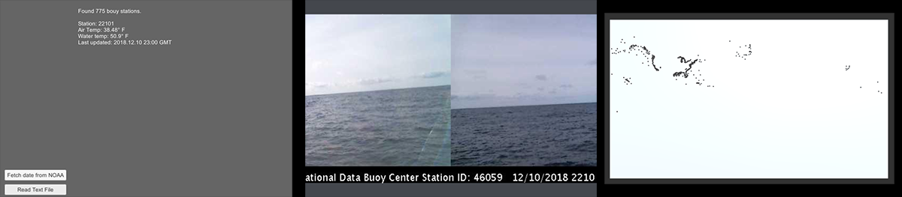

# WebRequests

This project is a simple example of gathering data from a web page using Unity's built-in UnityWebRequest. There are three scenes demonstrating how to fetch text data (the locations and temperature data from [NOAA](https://www.ndbc.noaa.gov/) bouys. The data is assembled into a custom object. Another scene shows how to fetch an image from a known web location, such as the bouycams. The third scene shows how to map the bouy locations based on a rectangle quad in the scene.
